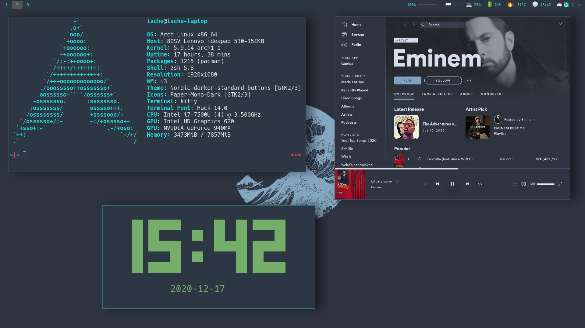

# Dotfiles
Dotfiles for my arch linux build

> Theme: Solarized-dark

## Configs:
- i3-gaps (WM) **extras:**[i3-gaps-rounded-corners](https://aur.archlinux.org/packages/i3-gaps-rounded-git/)
- i3blocks (Status bar) **extras:** [i3blocks-contrib](https://github.com/vivien/i3blocks-contrib)
- kitty (Terminal emulator) **extras:**
- rofi (Window switcher) **extras:**
- ranger (Terminal file manager) **extras:** [ranger_devicons](https://github.com/alexanderjeurissen/ranger_devicons)
- picom (Compositor) **extras:**
- lightdm (Display manager) **extras:**
- zsh (Shell) **extras:** [oh-my-zsh](https://github.com/ohmyzsh/ohmyzsh)
  - [plugins](https://github.com/ohmyzsh/ohmyzsh/wiki/Plugins)=(git archlinux copydir vi-mode web-search colorize copyfile extract z)
- emacs (Text editor) **extras:** [doom-emacs](https://github.com/hlissner/doom-emacs)
  - Themes: 
    - [doom-solarized-dark (not compatible with terminal)](https://github.com/hlissner/emacs-doom-themes)
    - [solarized-emacs (Terminal)](https://github.com/sellout/emacs-color-theme-solarized)

## Other directories
- fonts: [Hack](https://github.com/source-foundry/Hack), [Font Awesome](https://github.com/FortAwesome/Font-Awesome)
- scripts
- wallpapers
